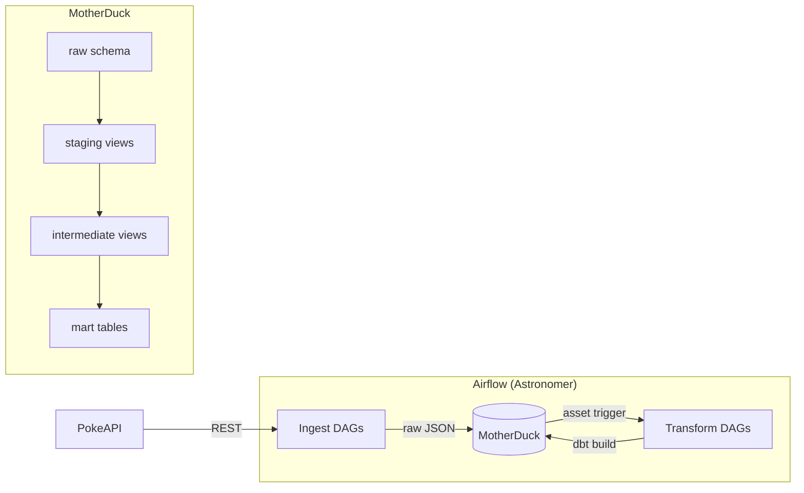

# pokemon_airflow

A data pipeline that ingests Pokemon data from [PokeAPI](https://pokeapi.co), loads it into [MotherDuck](https://motherduck.com) (cloud DuckDB), and transforms it through a full dbt modeling layer — orchestrated by [Apache Airflow](https://airflow.apache.org/).


## Architecture



## Overview

The project fetches data for all 9 generations, 27 version groups, 1025 Pokemon, and 937 moves from PokeAPI. Each entity has its own ingest DAG that loads raw JSON payloads into MotherDuck, and a transform DAG that runs dbt models downstream. DAGs are chained via Airflow assets — ingestion completion triggers transformation automatically.

Data flows through four layers:
- **raw** — JSON payloads as-is from the API
- **staging** — views that parse JSON into typed columns
- **intermediate** — views that reshape, denormalize, and enrich
- **marts** — incremental tables ready for analysis

## Tech Stack

| Component | Technology | Role |
|-----------|-----------|------|
| Orchestration | Apache Airflow (Astronomer Runtime) | DAG scheduling, asset-based triggers |
| Transformation | dbt-core + dbt-duckdb | SQL modeling, testing, incremental loads |
| Data warehouse | MotherDuck (cloud DuckDB) | Storage and compute |
| Data source | PokeAPI | REST API for all Pokemon data |
| Integration | astronomer-cosmos | Runs dbt models as native Airflow tasks |
| Serialization | PyArrow | Efficient data transfer to DuckDB |

## Pipelines

### DAGs

| DAG | Schedule | Description |
|-----|----------|-------------|
| `setup__motherduck` | Manual | One-time setup — creates raw schema and tables |
| `ingest__generations` | Manual | Fetches all generations, skips if already ingested |
| `transform__generations` | Asset: `raw/generations` | Runs generation dbt models |
| `ingest__version_groups` | Manual | Fetches all version groups, skips if already ingested |
| `transform__version_groups` | Asset: `raw/version_groups` | Runs version group dbt models |
| `ingest__pokemon_catalogue` | Weekly | Fetches all pokemon species per generation |
| `transform__pokemon_catalogue` | Asset: `raw/pokemon_catalogue` | Stages the catalogue for downstream use |
| `ingest__pokemons` | Asset: `staging/stg_pokemon_catalogue` | Fetches full pokemon data in batches of 50 |
| `transform__pokemons` | Asset: `raw/pokemons` | Runs all pokemon dbt models (stats, types, moves) |
| `ingest__moves` | Asset: `raw/generations` | Fetches move details in batches of 50 |
| `transform__moves` | Asset: `raw/moves` | Runs move detail dbt models |
| `check__source_freshness` | Weekly | Runs dbt source freshness checks |

### dbt Models

| Layer | Model | Description |
|-------|-------|-------------|
| **Staging** | `stg_pokemon_catalogue` | Pokemon IDs and names per generation |
| | `stg_pokemons` | Core pokemon attributes (name, height, weight) |
| | `stg_pokemon_moves` | Raw pokemon-move relationships from pokemon payload |
| | `stg_stats` | Pokemon base stats (JSON array) |
| | `stg_types` | Pokemon current types |
| | `stg_past_types` | Pokemon historical type changes |
| | `stg_past_stats` | Pokemon historical stat changes |
| | `stg_generations` | Generation IDs and English names |
| | `stg_version_groups` | Version groups with game versions |
| | `stg_move_details` | Move attributes (power, accuracy, PP, type, damage class) |
| **Intermediate** | `int_stats` | Pivoted stats (one column per stat) |
| | `int_types` | Parsed current types with slot info |
| | `int_past_types` | Parsed historical types |
| | `int_past_stats` | Parsed historical stats |
| | `int_type_history` | Full type timeline with validity windows |
| | `int_pokemon_moves` | Parsed pokemon-move-version group relationships |
| | `int_stats_history` | Full stat timeline with validity windows |
| **Marts** | `mart_pokemons` | One row per pokemon with core attributes |
| | `mart_stats` | One row per pokemon with all six base stats |
| | `mart_types` | Full type history per pokemon per slot |
| | `mart_moves` | One row per move with attributes |
| | `mart_pokemon_moves` | Pokemon x move x version group x learn method |
| | `mart_generations` | One row per generation |
| | `mart_version_groups` | One row per version group |
| | `mart_version_group_versions` | Game versions mapped to version groups |
| | `mart_strongest_pokemons` | All pokemon ranked by total stats with tier labels |
| | `mart_strongest_starters` | Starter pokemon ranked by total stats |

## Project Structure

```
dags/                          # Airflow DAG definitions
  ingest__*.py                 #   API → raw (PokeAPI ingestion)
  transform__*.py              #   raw → marts (dbt via cosmos)
  setup__motherduck.py         #   one-time table creation
  check__source_freshness.py   #   dbt source freshness
include/
  transforms/                  # dbt project
    models/
      staging/                 #   views over raw JSON
      intermediate/            #   reshaped/enriched views
      marts/                   #   incremental tables
    tests/                     #   custom data quality tests
    macros/                    #   shared SQL macros
  callbacks/                   # Airflow failure callbacks
Dockerfile                     # Astronomer Runtime 3.1
requirements.txt               # Python dependencies
```

## Getting Started

### Prerequisites

- [Docker Desktop](https://www.docker.com/products/docker-desktop/) running
- [Astro CLI](https://docs.astronomer.io/astro/cli/install-cli) installed
- A [MotherDuck](https://motherduck.com) account with a service token and a database named `poke_db`

### Setup

```bash
# Clone and enter
git clone <repo-url>
cd pokemon_airflow

# Set your MotherDuck token
export motherduck_token=your_token_here

# Start Airflow
astro dev start
```

Airflow UI at **http://localhost:8080** (admin / admin).

### First Run

1. Trigger `setup__motherduck` to create raw tables
2. Trigger `ingest__pokemon_catalogue` — this kicks off the pokemon pipeline automatically via assets
3. Trigger `ingest__generations` — this kicks off generations, version groups, and moves pipelines

## Roadmap

- [x] Pokemon ingestion + full dbt modeling (stats, types, moves)
- [x] Generation and version group pipelines
- [x] Move detail pipeline (power, accuracy, type, damage class)
- [x] Custom dbt data quality tests
- [x] Asset-based DAG chaining
- [ ] NL-to-SQL query interface
