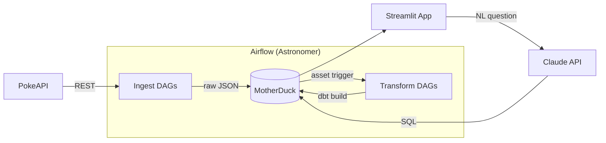

# Architecture

This document explains *why* the system is built the way it is — the decisions behind the stack, the data flow, and the patterns used.

For *what* the system does and how to run it, see the [README](../README.md).

---

## System overview



**Data flow:** PokeAPI → Airflow ingest → raw JSON in MotherDuck → dbt transforms (staging → intermediate → marts) → Streamlit app / NL-to-SQL

---

## Stack decisions

### Why Airflow

Orchestrates multi-step pipelines with dependency management, retries, and monitoring. The project has 12 DAGs with complex inter-dependencies — a cron job or script wouldn't scale.

**Why Astronomer Runtime:** Provides a managed Airflow environment with Docker-based local dev (`astro dev start`). No need to manage Airflow infrastructure.

### Why dbt

SQL-based transformations with built-in testing, documentation, and lineage. Separates transformation logic from orchestration logic.

**Why Cosmos:** Runs dbt models as native Airflow tasks, so each model appears individually in the Airflow UI with its own retry/failure handling. Without Cosmos, dbt would run as a single opaque `BashOperator`.

### Why DuckDB / MotherDuck

Analytical queries on structured data without managing a database server. MotherDuck adds cloud persistence and sharing.

**Why not Postgres/BigQuery/Snowflake:** The dataset is small (~1K pokemon, ~1K moves). A full warehouse is unnecessary overhead. DuckDB handles this scale with zero infrastructure.

### Why Streamlit

Fast prototyping for data apps. The NL-to-SQL feature needs a chat interface and dataframe display — Streamlit provides both with minimal frontend code.

---

## Key design patterns

### Asset-based DAG chaining

DAGs are chained through Airflow Assets (formerly Datasets), not explicit `TriggerDagRunOperator` calls.

**How it works:**
- Each ingest DAG declares an **outlet asset** (e.g. `motherduck://raw/pokemons`)
- Each transform DAG declares that same asset as its **schedule trigger**
- When the ingest DAG completes and fires the outlet, Airflow automatically schedules the downstream transform DAG

**Why this pattern:**
- Decouples producers from consumers — adding a new downstream DAG requires zero changes to the producer
- Visible in Airflow's DAG Dependencies view
- Safer than `TriggerDagRunOperator` which creates tight coupling and can cause cascade failures

### Skip-if-exists ingestion

Ingest DAGs check what's already in the database before fetching from the API.

**How it works:**
- `ingest__pokemons`: ANTI JOIN against `raw.pokemons` to find missing pokemon IDs
- `ingest__generations` / `ingest__version_groups`: Compare DB count vs API count
- `ingest__moves`: Set difference between API move IDs and DB move IDs
- `ingest__pokemon_catalogue`: Deduplicates on generation ID during INSERT

**Why this pattern over truncate-and-reload:**
- Pokemon data is static (a pokemon's stats don't change once released)
- Avoids unnecessary API calls — PokeAPI is rate-limited and courtesy matters
- Makes re-runs safe: if a DAG fails mid-batch, re-running picks up where it left off

### Batch ingestion

Pokemon and move ingestion fetch data in batches of 50 per DAG run.

**Why:** PokeAPI has ~1,025 pokemon and ~937 moves. Fetching all in one task would take 15+ minutes and risk timeouts. Batching means each run is short, and the asset trigger re-fires the DAG until all data is ingested.

### Medallion architecture (raw → staging → intermediate → marts)

| Layer | Materialization | Purpose |
|-------|----------------|---------|
| **raw** | Tables | JSON payloads as-is from the API. Append-only. |
| **staging** | Views | Parse JSON into typed columns. One view per source table. |
| **intermediate** | Views | Reshape, denormalize, pivot, enrich. Business logic lives here. |
| **marts** | Incremental tables | Consumption-ready. One table per business entity. |

**Why four layers instead of two (raw → marts):**
- Staging isolates JSON parsing — if the API payload changes, only one view needs updating
- Intermediate isolates business logic (e.g. SCD Type 2 type history) from the final schema
- Each layer is independently testable

### Incremental loads

Mart tables use dbt's `incremental` materialization with a custom macro (`mart_incremental_load_config`).

**Why:** Avoids full table rebuilds on every run. Only new/changed rows flow through. For static data like pokemon, this means the first load does the work and subsequent runs are no-ops.

---

## Pipeline topology

Two independent pipeline chains run in parallel:

```
Chain 1 — Pokemon pipeline:
  ingest__pokemon_catalogue (@weekly)
    → transform__pokemon_catalogue (asset: raw/pokemon_catalogue)
      → ingest__pokemons (asset: staging/stg_pokemon_catalogue)
        → transform__pokemons (asset: raw/pokemons)

Chain 2 — Reference data pipeline:
  ingest__generations (manual)
    → transform__generations (asset: raw/generations)
    → ingest__moves (asset: raw/generations)
      → transform__moves (asset: raw/moves)

  ingest__version_groups (manual)
    → transform__version_groups (asset: raw/version_groups)

Standalone:
  setup__motherduck (manual, one-time)
  check__source_freshness (@weekly)
```
